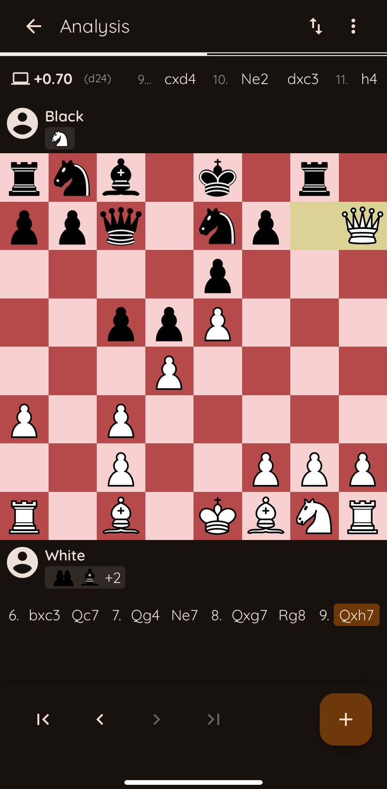

# ♟️ Pawncake

**Pawncake** is a real-time multiplayer chess web app with guest accounts, engine-powered analysis, PWA support, and a modern UI — built with Angular, FastAPI, Redis, and Kubernetes.

📌 **Note**: This repository is for informational purposes only. The source code is private.

---

## 🌐 Live App

Access the live version here: [https://pawncake.app](https://pawncake.app)

---

## 🧠 Motivation

I'm a chess enthusiast, so building Pawncake was the perfect way to combine my love for the game with my passion for software development.

This project was created to deepen my expertise in full-stack development, real-time systems, and DevOps. I aimed to build a production-grade, installable web app with WebSockets, containerized infrastructure, and a modern UI — all tailored for a smooth multiplayer chess experience.

---

## 📸 Screenshots

> A glimpse of the Pawncake experience.

### 🕹️ Gameplay
The main playing screen features a clean, distraction-free board UI with real-time updates, time control, and move navigation.

  
   <em>Mobile Gameplay</em>

---

### 📊 Engine Analysis
Live Stockfish-powered analysis with evaluation bar and best move suggestions.

  
   <em>Mobile analysis</em>

---

## 🧩 Key Features

- Guest login with seamless upgrade to registered account
- Real-time multiplayer chess with WebSocket-powered gameplay
- Analysis with engine support
- Clean UI using Angular Material 3
- PWA support for installable experience
- Designed for both casual play and future puzzle/training modes

---

## ⚙️ Tech Stack

- **Frontend**: Angular + Angular Material 3
- **Backend**: FastAPI + WebSockets
- **Analysis worker**: Python (Stockfish integration via python-chess)
- **Database**: PostgreSQL
- **Cache / Queue**: Redis (matchmaking, locks, Pub/Sub)
- **Dev Environment**: Docker Compose (`docker-compose.dev.yml`)
- **Production Environment**: k3d + Helm + Jenkins
- **CI/CD**: Jenkins (build, test, deploy)

---

## 🔒 Authentication

- Guest login using HTTP-only cookies
- Basic email-based signup and login
- Users can upgrade from guest to registered accounts without losing game history
- Stateless backend with secure session management

---

## 🛠️ Deployment & Infrastructure

- Separate pipelines for test and production environments
- The `develop` branch deploys to test; the `main` branch is used for production
- Nginx reverse proxy is used in production for unified routing
- Redis is used for matchmaking and coordination across services

---

## 🛣️ Roadmap

- [x] Authentication
- [x] Real-time gameplay with WebSockets
- [x] Time controls (e.g. 3+2, 5+0)
- [x] Premove
- [x] Engine analysis
- [ ] Puzzle mode
- [ ] Spectator mode
- [ ] Tournaments

> 🚧 Active development: New features are being added regularly.

---

## 📬 Contact

For questions or legal concerns: **support@pawncake.app**